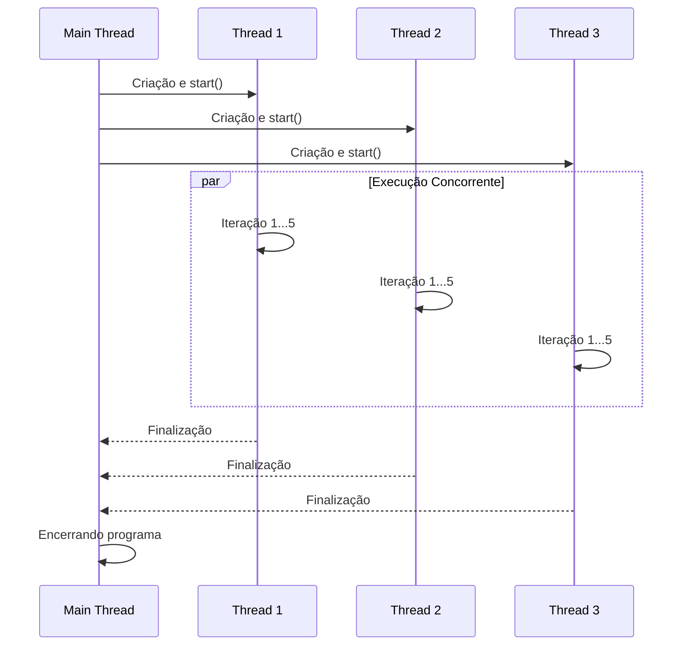

# 🧵 Demonstração de Multithreading em Python

Este projeto contém um **script em Python** que demonstra a criação e execução de múltiplas **threads** de forma concorrente, utilizando a biblioteca padrão [`threading`](https://docs.python.org/3/library/threading.html).

O objetivo é evidenciar como tarefas podem ser executadas "ao mesmo tempo", com uma saída no console que mostra a intercalação das operações de cada thread.

---

## ⚙️ Tecnologias Utilizadas

- **Python 3**
- **Módulo [`threading`]** → criação e gerenciamento das threads.
- **Módulo [`time`]** → utilização de `sleep()` para simular tarefas demoradas.

---

## 📖 Funcionamento

1. **Função `worker`**  
   Define a lógica executada por cada thread.  
   Simula uma tarefa de **5 segundos**, imprimindo mensagens a cada iteração.

2. **Criação das Threads**  
   No bloco principal, são criadas **3 instâncias** de `threading.Thread`, cada uma configurada para rodar `worker`.

3. **Execução Concorrente**  
   O método `.start()` inicia as threads, que passam a rodar **em paralelo**.

4. **Sincronização**  
   O método `.join()` garante que o programa principal **aguarde a conclusão** de todas as threads antes de encerrar.

---

## 🚀 Como Executar

### Pré-requisitos
- Ter o [Python 3](https://www.python.org/downloads/) instalado.

### Passos
```sh
# 1. Clone o repositório
git clone https://github.com/marcosgabrielms/Desafio_Surpresa_Threads.git

# 2. Entre no diretório do projeto
cd Desafio_Surpresa_Threads

# 3. Execute o script
python multithread_example.py
```

---

## 🖥️ Saída Esperada

Ao rodar o script, o terminal exibirá mensagens semelhantes às abaixo.  
Note como as execuções das **3 threads** se intercalam, evidenciando a concorrência:

```
Main: Iniciando o programa e criando as threads...

----> Thread 1: Iniciando.
----> Thread 2: Iniciando.
----> Thread 3: Iniciando.

Main: Todas as threads foram criadas. Aguardando a finalização delas...

----> Thread 1: executando a iteração 1
----> Thread 3: executando a iteração 1
----> Thread 2: executando a iteração 1
----> Thread 2: executando a iteração 2
----> Thread 1: executando a iteração 2
----> Thread 3: executando a iteração 2
...
...
====== Thread 2: Finalizando. ======
====== Thread 1: Finalizando. ======
====== Thread 3: Finalizando. ======

Main: Todas as threads finalizaram. Encerrando o programa.
```

---

## 🗂️ Diagrama de Execução



---
